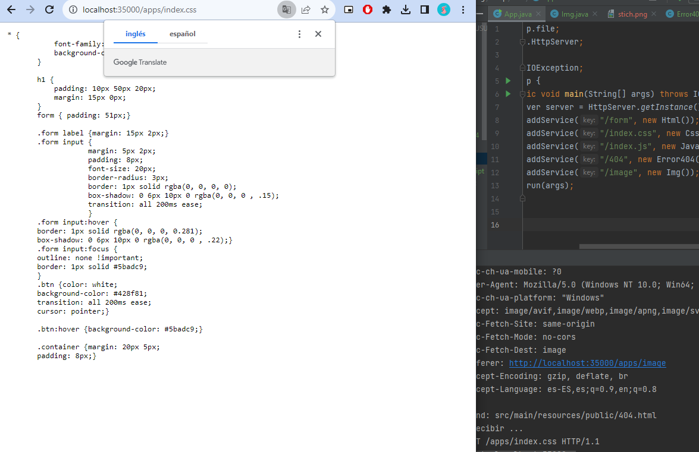
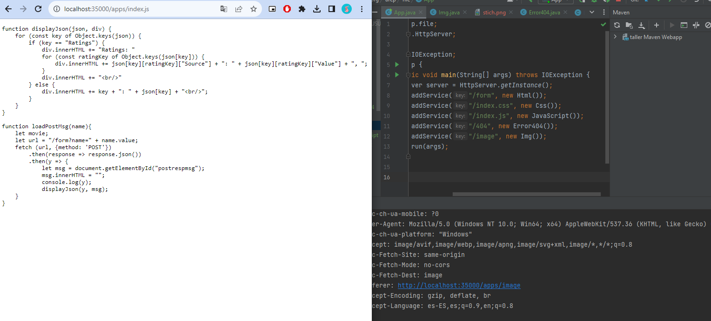

# Aplicaciones Distribuidas (HTTP, SOCKETS, HTML, JS,MAVEN, GIT)
##STEFANIA GIRALDO BUITRAGO
mediante la API https://omdbapi.com/ Se le pide que su implementación sea eficiente en cuanto a recursos 
así que debe implementar un Caché que permita evitar hacer consultas repetidas al API externo
La arquitectura debe tener las siguientes características.

-El cliente Web debe ser un cliente asíncrono que corra en el browser  y use Json como formato para los mensajes.
-El servidor de servirá como un gateway para encapsular llamadas a otros servicios Web externos.
-La aplicación debe ser multiusuario.
-Todos los protocolos de comunicación serán sobre HTTP.
-Los formatos de los mensajes de intercambio serán siempre JSON.
-La interfaz gráfica del cliente debe ser los más limpia y agradableolo HTML y JS (Evite usar librerías complejas). Para invocar métodos REST desde el cliente usted puede utilizar la tecnología que desee.
-Debe construir un cliente Java que permita probar las funciones del servidor fachada. El cliente utiliza simples conexiones http para conectarse a los servicios. Este cliente debe hacer pruebas de concurrencia en su servidor de backend.
-La fachada de servicios tendrá un caché que permitirá que llamados que ya se han realizado a las implementaciones concretas con parámetros específicos no se realicen nuevamente. Puede almacenar el llamado como un String con su respectiva respuesta, y comparar el string respectivo. Recuerde que el caché es una simple estructura de datos.
-Se debe poder extender fácilmente, por ejemplo, es fácil agregar nuevas funcionalidades, o es fácil cambiar el proveedor de una funcionalidad.
-Debe utilizar maven para gestionar el ciclo de vida, git y github para almacenar al código fuente y heroku como plataforma de producción.
-En el backend debe utilizar solo Java. No puede utilizar frameworks como SPRING.
para usarlo se debe ingresar a un navegador de busqueda y colocar:
```
localhost:35000
````
y luego encontraremos esta pantalla a la cual se le hizo un diseño basico pero agradable al usuario
 en donde al presionar la tecla de busqueda cambia de color


luego podemos observar las diferentes busquedas que se realizaron


ahora observamos en el terminal como aparece la busqueda en el servidor


y por ultimo mostramos las pruebas unitarias funcionando correctamente


#TALLER DISEÑO Y ESTRUCTURACIÓN DE APLICACIONES DISTRIBUIDAS EN INTERNET
````
Escriba un servidor web que soporte múlltiples solicitudes seguidas (no concurrentes). 
El servidor debe leer los archivos del disco local y retornar todos los archivos solicitados,
incluyendo páginas html, archivos java script, css e imágenes. Construya una aplicación web con 
javascript, css, e imágenes para probar su servidor. Incluya en la aplicación la comunicación asíncrona
con unos servicios REST en el backend. NO use frameworks web como Spark o Spring, use solo Java y las librerías para manejo de la red.
````

se realizo los respectivos cambios al codigo anterior para que retornara los archivos solicitados




